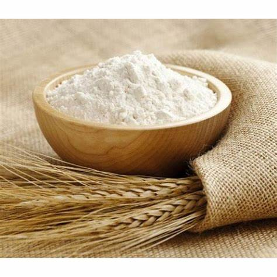

# Recette de Cookies faciles :cookie:

`Ingrédients :`

    

        
        
Farine

    

     

        
        
levure chimique

    

     

        
        
beurre

    

     

        
        
Chocolat

    

    

        
        
Sucre vanille

    

    

        
        
Oeuf

    

---

`Preparation :`
## Etape 1 

#### Préchauffer le four à 180°C (thermostat 6). Faire ramollir le beurre puis le mélanger au sucre et à l'œuf dans un récipient. Verser le sucre vanillé, la levure et mélanger.
---
## Etape 2
#### Petit à petit, verser la farine tout en remuant afin que la pâte soit bien lisse et homogène. Incorporer les pépites de chocolat.
---
## Etape 3
#### Sur une plaque de papier sulfurisé, former de petites boules avec la pâte à cookies. Veiller à bien espacer chacune des petites boules (laisser 2 à 3 cm entre chaque) car elles vont s'élargir durant la cuisson.
---
## Etape 4
#### Enfourner pendant 10 min. Dès que les bords des cookies brunissent, les retirer du four. 
